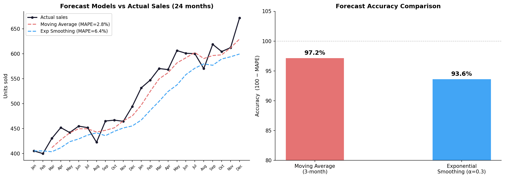
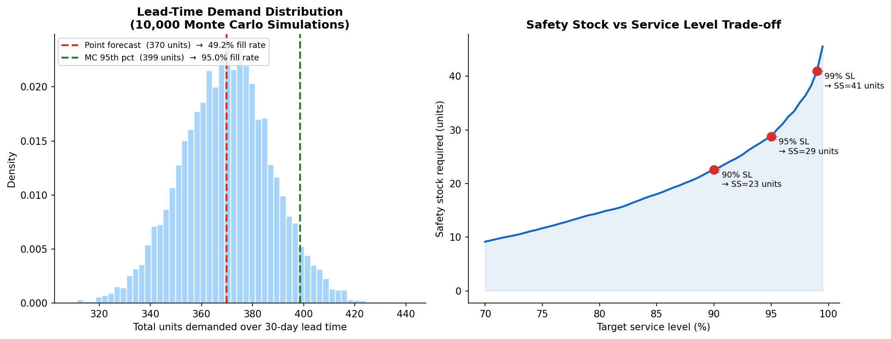
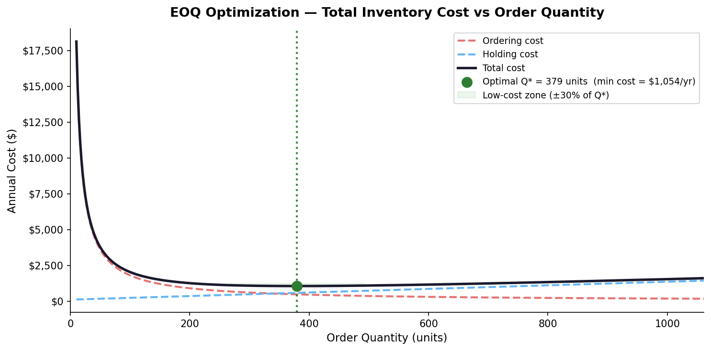
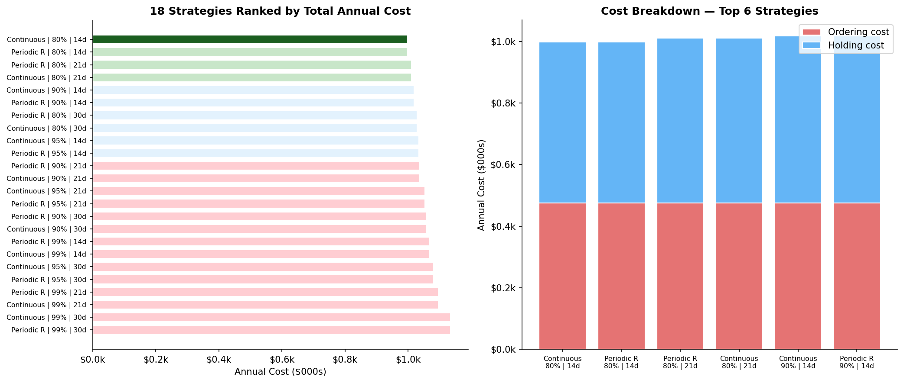

# inventory-optimisation

**Tools:** Python (NumPy, pandas, matplotlib, scipy) · Excel (Solver, Data Tables) 

Every retailer faces the same question: **how much stock should we hold?** Too much and you're paying to store inventory that isn't selling. Too little and customers can't buy what they want.

This project works through that problem end to end:

1. **Demand forecasting** — predict future sales using Moving Average and Exponential Smoothing
2. **Monte Carlo simulation** — quantify how uncertain those forecasts are across 10,000 demand scenarios
3. **Inventory optimization** — use Excel Solver to find the order quantity that minimizes total cost
4. **Scenario analysis** — compare 18 different inventory policies and rank them by annual cost

## Forecasting models:

- **Moving Average** — simple baseline. Predicts next period = average of last N periods.  
- **Exponential Smoothing** — weighted average where recent data counts more (controlled by α).  
Both models are implemented in Excel.

## Monte Carlo simulation — demand uncertainty
A point forecast tells you the *expected* demand. Monte Carlo simulation tells you the *distribution* of possible demand outcomes.

**Key finding:** Stocking to the point forecast alone results in stockouts ~45% of the time during high-demand periods. Stocking to the MC 95th percentile raises the fill rate to 95%+ with a manageable increase in holding cost.

## EOQ optimization 

The Economic Order Quantity (EOQ) model finds the order size that minimizes total annual  
inventory cost, which has two competing components:
- **Ordering cost** decreases as order size increases 
- **Holding cost** increases as order size increases
  
Excel Solver was used to minimize the total cost function by changing the order quantity. 

## Scenario analysis — 18 strategies compared

Evaluated every combination of:
- **Policy type:** Continuous Review vs Periodic Review
- **Service level:** 80%, 90%, 95%, 99%
- **Lead time:** 14, 21, or 30 days
Each was scored on ordering cost, holding cost, and total annual cost.

